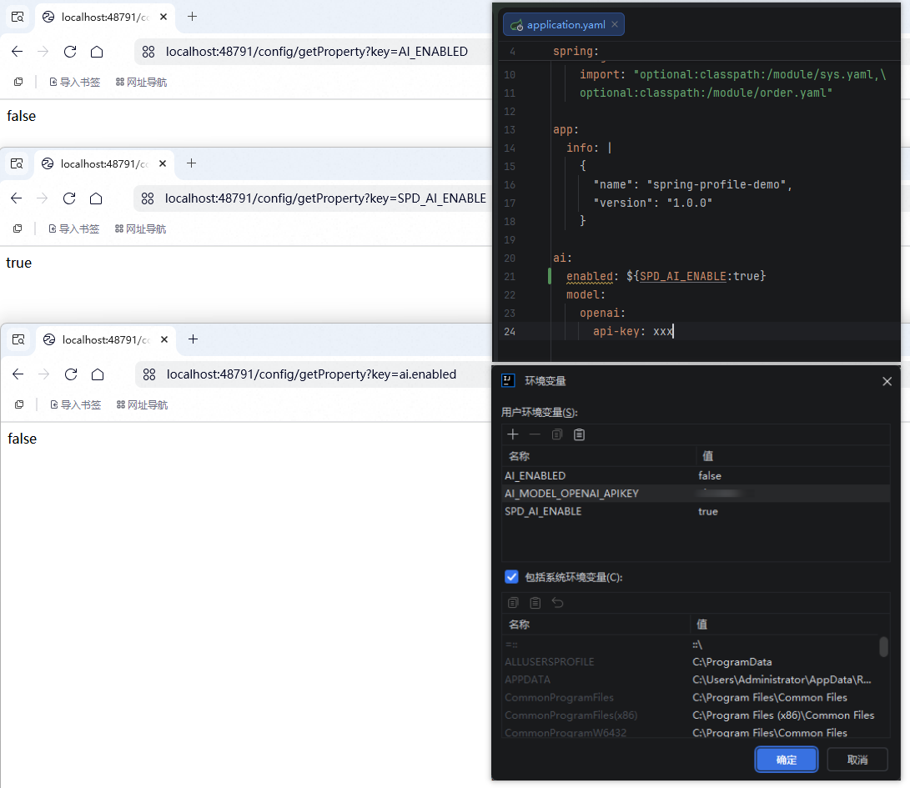

# 🌱 spring-profile-demo

[](https://www.oracle.com/java/technologies/javase/jdk21-archive-downloads.html)
[](https://spring.io/projects/spring-boot)
[](https://github.com/dragonwell-project/dragonwell21)

> Spring Profile 示例项目，基于 **Spring Boot 4.1.1** + **Java 21** 构建。

演示 Spring 多环境配置激活、多模块配置文件引入（`spring.config.import`）以及 YAML 中多行文本与 JSON 字符串映射。

## ✨ 特性

- 🌐 多环境配置（`application-dev.yaml` / `application-prod.yaml`）
- 📁 模块化配置导入（`module/sys-*.yaml` / `module/order-*.yaml`）
- 📄 YAML 多行文本与 JSON 解析（Fastjson2）
- 🐉 基于 Alibaba Dragonwell JDK 21 构建

## 🚀 快速开始

### 📥 下载构建产物

前往 [GitHub Releases](https://github.com/netbuffer/spring-profile-demo/releases) 页面下载最新的 `spring-profile-demo.jar`。

### ▶️ 直接运行

```bash
java -jar spring-profile-demo.jar
```

本地默认端口见 `application.yaml` 中的 **48791**；Docker 示例使用 **8080**。均可通过环境变量 `SERVER_PORT` 覆盖。

### 🐳 Docker 运行

先构建 jar 包，再构建镜像：

```bash
mvn clean package -DskipTests
docker build -t spring-profile-demo .
```

```bash
docker run -it --rm -p 8080:8080 spring-profile-demo
```

自定义 JVM 参数和环境变量：

```bash
docker run -it --rm -p 8080:8080 \
  -e TZ=Asia/Shanghai \
  -e SPRING_PROFILES_ACTIVE=dev \
  -e JAVA_OPTS="-XX:+PrintCommandLineFlags" \
  spring-profile-demo
```

### 🐙 Docker Compose

```bash
mvn clean package -DskipTests
docker compose up -d
```

## 🔨 构建

项目使用 [Dragonwell JDK 21](https://github.com/dragonwell-project/dragonwell21) 构建，推荐通过 GitHub Actions 自动完成。

```bash
mvn clean package -DskipTests
```

构建产物位于 `target/spring-profile-demo.jar`。

本地开发运行：

```bash
mvn spring-boot:run
```

## 🔄 CI/CD

推送至 `master` / `main` 分支或创建 `v*` 标签时，GitHub Actions 将自动：

1. 🐉 使用 Dragonwell JDK 21 编译打包
2. 📦 上传构建产物（可在 Actions 页面登录下载）
3. 🏷️ 创建 `v*` 标签时，自动发布 jar 包到 GitHub Releases
4. 🐳 创建 `v*` 标签时，自动构建镜像并推送到 ghcr.io

## 📚 外部化配置与环境变量覆盖机制

**是的，这是 Spring Boot 框架原生的核心机制**（基于 Externalized Configuration 外部化配置优先级与 Relaxed Binding 松散绑定规则）。

### 1. 优先级覆盖原理
Spring Boot 预定义了严格的 `PropertySource` 加载与覆盖顺序，**OS 环境变量（OS environment variables）的优先级高于应用配置文件（`application.yaml` / `application.properties`）**。因此，系统或容器中的同名环境变量会直接覆盖配置文件中的预设值。

### 2. Relaxed Binding（松散绑定）转换规则
为了适配不同操作系统环境变量（如 Linux 只支持大写字母、数字及下划线）的命名规范，Spring Boot 提供了 Relaxed Binding 规则进行自动映射转换：
- 点号（`.`）替换为下划线（`_`）
- 横杠（`-`）移除（例如 `api-key` -> `APIKEY`）或部分情况映射为下划线（例如 `api-key` -> `API_KEY`）
- 全部转换为大写

以配置项为例：
```yaml
ai:
  model:
    openai:
      api-key: xxx
```
规范属性名为 `ai.model.openai.api-key`，对应环境变量为：
- `AI_MODEL_OPENAI_API_KEY`
- 或 `AI_MODEL_OPENAI_APIKEY`

当注入 `AI_MODEL_OPENAI_API_KEY` 环境变量时，Spring Boot 会自动匹配并覆盖 `ai.model.openai.api-key`。

### 3. 典型案例：环境变量优先级“短路”覆盖 YAML 占位符

#### 场景设定
在 `application.yaml` 中配置了间接占位符：
```yaml
ai:
  enabled: ${SPD_AI_ENABLE:true}
```
同时在启动环境（如 IDEA 运行配置或 Docker 环境变量）中设置了：
```bash
SPD_AI_ENABLE=true
AI_ENABLED=false
```

#### 请求结果与现象
通过 `/config/getProperty` 接口（底层调用 `Environment.getProperty(key)`）查询：
| 请求参数 `key` | 返回结果 | 核心解析机制 |
|:---|:---|:---|
| `SPD_AI_ENABLE` | `true` | 直接精确匹配到环境变量 `SPD_AI_ENABLE=true` |
| `AI_ENABLED` | `false` | 直接精确匹配到环境变量 `AI_ENABLED=false` |
| `ai.enabled` | `false` | **未解析 YAML 占位符，而是直接被 `AI_ENABLED=false` 覆盖** |



#### 为什么 `ai.enabled` 没有变成 `true`？
1. **配置源（PropertySource）加载顺序短路**：Spring 在读取属性时按优先级链从高到低依次查找。OS 环境变量（`systemEnvironment`）的优先级远高于 `application.yaml`。
2. **`SystemEnvironmentPropertySource` 宽松解析机制**：当 Spring 查询 `ai.enabled` 时，底层 `SystemEnvironmentPropertySource` 会将属性名转为大写并替换点号为下划线（即 `AI_ENABLED`），并在系统环境变量中直接命中值 `false`。
3. **低优先级占位符不被执行**：一旦在高优先级源（环境变量）中成功解析出属性值，Spring 立即返回该值，**不会继续向下读取或解析 `application.yaml`**。因此，YAML 中定义的 `${SPD_AI_ENABLE:true}` 占位符完全被屏蔽短路。
4. **验证对照**：若从环境中移除 `AI_ENABLED=false`，`ai.enabled` 将退回到 `application.yaml` 进行属性求值，此时才会解析 `${SPD_AI_ENABLE}`，返回结果变为 `true`。

### 4. Spring 官方文档参考
- **外部化配置加载顺序与优先级**：
  [Spring Boot Reference - Externalized Configuration](https://docs.spring.io/spring-boot/reference/features/external-config.html)
- **环境变量松散绑定机制（Binding From Environment Variables）**：
  [Spring Boot Reference - Binding From Environment Variables](https://docs.spring.io/spring-boot/reference/features/external-config.html#features.external-config.typesafe-configuration-properties.relaxed-binding.environment-variables)
- **Spring Framework 核心 Environment 抽象与 SystemEnvironmentPropertySource**：
  [Spring Framework Reference - Environment Abstraction](https://docs.spring.io/spring-framework/reference/core/beans/environment.html)


